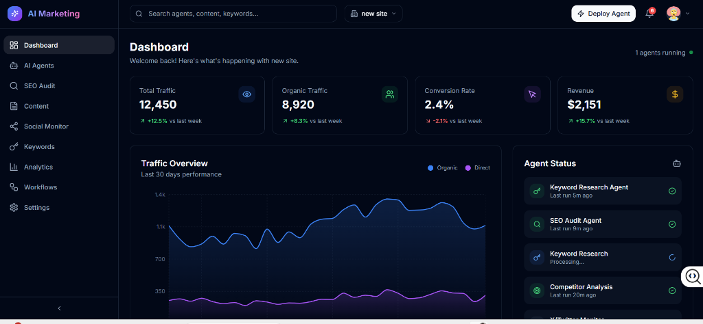
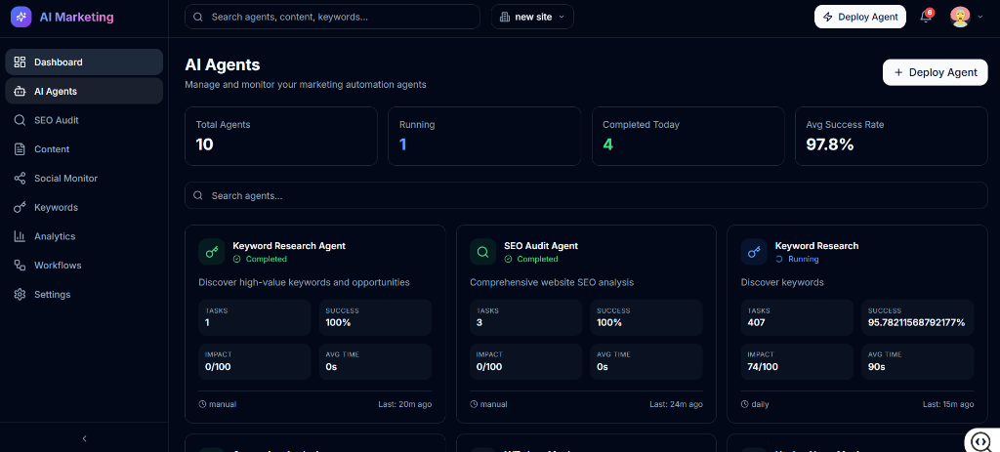

# AI Marketing Suite 🚀

A high-performance, enterprise-grade AI Marketing Automation platform. This suite integrates state-of-the-art AI agents with real-time analytics to automate SEO, content strategy, and social monitoring. Built with a robust full-stack architecture using React, Node.js, PostgreSQL, and Redis.

## 📱 UI Preview

<div align="center">
  
  <p><em>Real-time Dashboard with traffic analytics and agent status monitoring</em></p>
  
  <br />
  
  
  <p><em>Advanced AI Agent management and monitoring interface</em></p>
</div>

## 🌟 Core Value Proposition

The AI Marketing Suite moves beyond simple content generation. It provides a **synchronized ecosystem** where AI agents monitor the web, audit technical health, and execute marketing workflows autonomously.

- **Unified Intelligence**: 12+ specialized AI agents working on a single project context.
- **Persistent Memory**: System-wide notifications and project states persisted across sessions.
- **Asynchronous Scalability**: Background job processing via BullMQ ensures the UI remains responsive during complex AI tasks.
- **Data-Driven Insights**: Real-time traffic analytics and competitor benchmarking.

---

## 🛠️ Tech Stack & Architecture

### Frontend (Modern Client)
- **Framework**: [React 18](https://reactjs.org/) with [Vite](https://vitejs.dev/)
- **State Management**: [Zustand](https://github.com/pmndrs/zustand) with `persist` middleware for local cache.
- **Data Fetching**: [TanStack Query v5](https://tanstack.com/query/latest) for server-state synchronization.
- **Styling**: [Tailwind CSS](https://tailwindcss.com/) with a custom Glassmorphic design system.
- **Visuals**: [Framer Motion](https://www.framer.com/motion/) for micro-interactions and [Recharts](https://recharts.org/) for data viz.
- **UI Components**: [Radix UI](https://www.radix-ui.com/) primitives for high accessibility (A11y).

### Backend (Production Grade)
- **Runtime**: [Node.js](https://nodejs.org/) with [TypeScript](https://www.typescriptlang.org/) (`tsx`).
- **Framework**: [Express.js](https://expressjs.com/) with high-security middleware (Helmet, CORS, Rate Limiting).
- **Database**: [PostgreSQL](https://www.postgresql.org/) (via [Neon](https://neon.tech/)) with [Prisma ORM](https://www.prisma.io/).
- **Caching & Queues**: [Redis](https://redis.io/) (via [Upstash](https://upstash.com/)) with [BullMQ](https://docs.bullmq.io/).
- **AI Integration**: [OpenAI SDK](https://github.com/openai/openai-node) (compatible with DeepSeek and other LLMs).
- **Authentication**: Stateless JWT-based auth with bcrypt password hashing.

---

## 🤖 AI Agent Ecosystem

| Agent Type | Capability | Use Case |
| :--- | :--- | :--- |
| **SEO Audit** | Deep technical crawl & score | Website health & optimization |
| **GEO Optimizer** | AI Search Engine Optimization | Ranking in ChatGPT/Claude/Perplexity |
| **Content Writer** | Long-form SEO blog generation | Content marketing at scale |
| **Social Monitors** | Reddit, HN, X, LinkedIn tracking | Lead gen & brand sentiment |
| **Keywords** | Volume & Difficulty analysis | Competitive research |
| **Workflows** | Multi-step agent orchestration | Automating repetitive marketing tasks |

---

## 📂 Project Structure

```bash
ai-marketing-suite/
├── backend/                # Express Server (TypeScript)
│   ├── prisma/             # Database Schema & Migrations
│   ├── src/
│   │   ├── routes/         # API Endpoints (SEO, Keywords, Auth, etc.)
│   │   ├── services/       # Business Logic & AI Integrations
│   │   ├── workers/        # BullMQ Background Job Processors
│   │   └── server.ts       # Entry point
│   └── scripts/            # Database Seeding & Maintenance
├── src/                    # React Frontend
│   ├── components/
│   │   ├── agents/         # AI Agent Specific UIs
│   │   ├── dashboard/      # Analytics & Overview
│   │   └── ui/             # Reusable Design System Components
│   ├── store/              # Zustand Global State
│   ├── services/           # Axios API Client Layer
│   └── types/              # Unified TypeScript Interfaces
├── public/                 # Static Assets
└── tailwind.config.js      # Design Token Definitions
```

---

## 🚀 Getting Started

### Prerequisites
- **Node.js**: v18.0.0 or higher
- **PostgreSQL**: A running instance (or Neon connection string)
- **Redis**: A running instance (or Upstash connection string)

### 1. Backend Setup
```bash
cd backend
npm install
cp .env.example .env  # Configure your DATABASE_URL and REDIS_URL
npx prisma generate
npx prisma migrate dev
npm run db:seed       # Populate with high-fidelity demo data
npm run dev           # Runs on http://localhost:3002
```

### 2. Frontend Setup
```bash
# From root directory
npm install
cp .env.example .env  # Ensure VITE_API_URL=http://localhost:3002/api
npm run dev           # Runs on http://localhost:3000
```

---

## 📡 API Integration & Persistence

### Notification System
The suite features a persistent notification engine. Notifications are:
1. **Triggered** by backend events (Job completion, Project creation).
2. **Synchronized** via the `useStore` Zustand store.
3. **Persisted** to `localStorage` using the `persist` middleware, ensuring you never miss an alert after a refresh.

### Background Job Flow
1. User clicks "Run SEO Audit".
2. Frontend sends a request to `/api/seo/audit`.
3. Backend pushes a job to **BullMQ**.
4. **Worker** processes the site (OpenAI + Cheerio).
5. **Worker** saves results to PostgreSQL.
6. User is notified of completion.

---

## 🎨 Design Philosophy

We adhere to a **Premium Dark Aesthetic**:
- **Glassmorphism**: Using `backdrop-blur` and subtle borders to create depth.
- **Consistent Tokens**: Every spacing, color, and shadow is derived from `tailwind.config.js`.
- **Motion UX**: Every page transition and modal uses Framer Motion for a "native-app" feel.
- **Responsiveness**: Mobile-first grid layouts for monitoring on the go.

---

## 🔐 Security & Production Ready
- **Rate Limiting**: Protected against brute force and API abuse.
- **JWT Auth**: Secure session management.
- **Type Safety**: End-to-end typing from database to UI.
- **Clean Architecture**: Separation of concerns between API, Services, and State.

---

## 📄 License
MIT License - feel free to use and extend!
